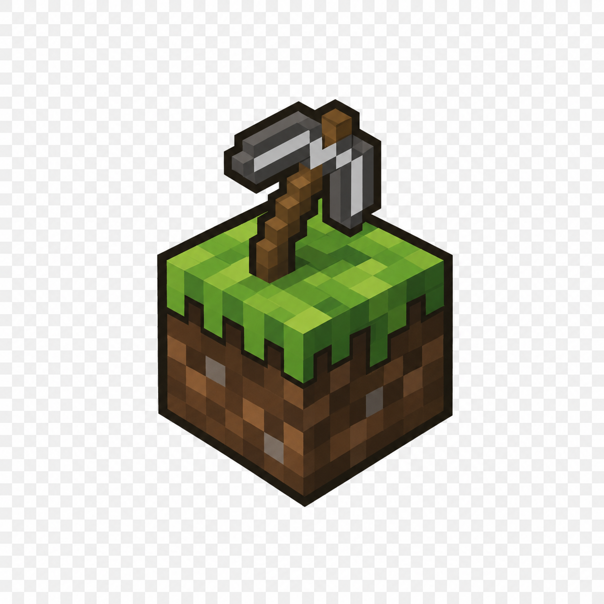
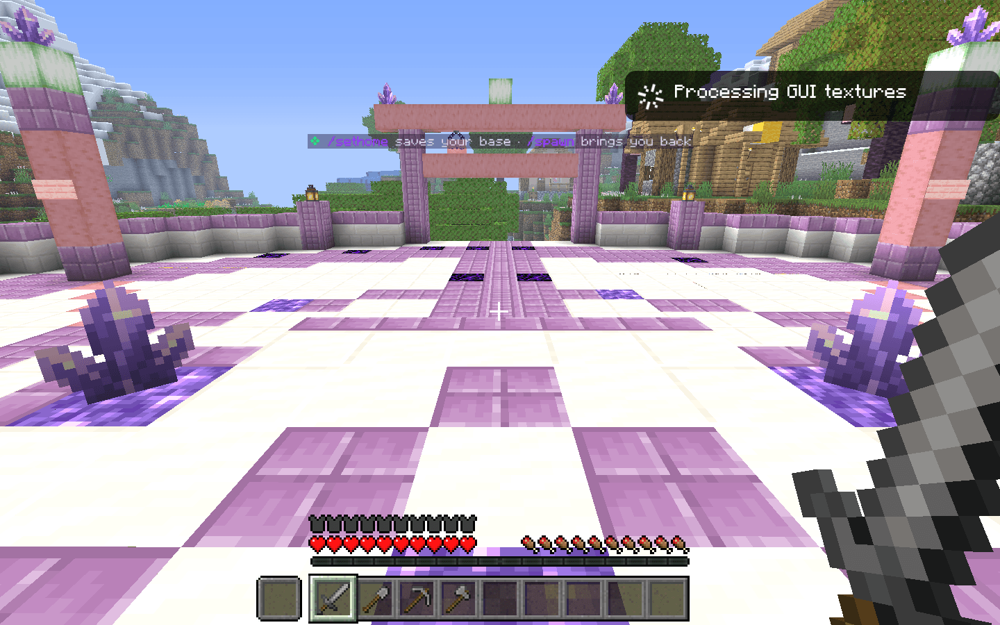
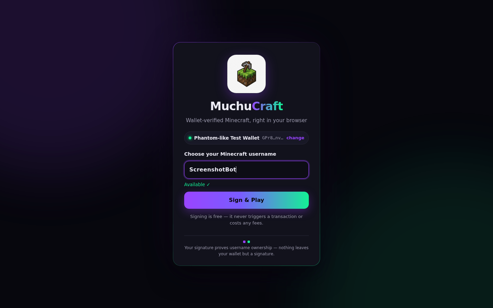
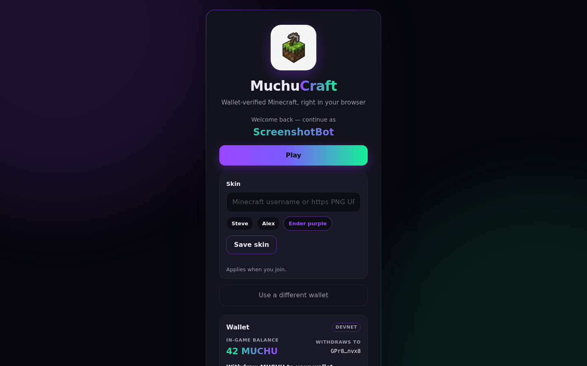
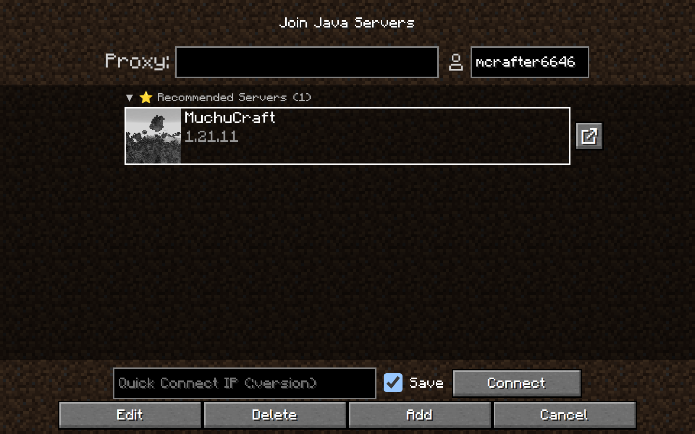

<p align="center">
  
</p>

<h1 align="center">MuchuCraft</h1>

<p align="center">
  <b>Real Minecraft. In your browser. Your wallet is your identity.</b>
</p>

<p align="center">
  <a href="https://web.muchu.app"><b>▶&nbsp; PLAY NOW — web.muchu.app</b></a>
</p>

<p align="center">
  
</p>

---

## What is MuchuCraft?

MuchuCraft is a real Minecraft survival server you play **entirely in your browser** —
no downloads, no launcher, no account passwords. Instead of the old
`/register <password>` dance, you connect a Solana wallet (Phantom, Solflare,
Backpack…) and sign a free message. That signature claims your username **forever**:
nobody can take your name, because nobody else has your wallet.

And the money in the game is real-ish too: the in-game currency **MUCHU is a Solana
token, 1:1**. Earn it by playing, cash it out to your wallet, or deposit tokens back
into the game. (Currently running on **devnet** — play money — while we polish.)

## How to play

1. **Go to [web.muchu.app](https://web.muchu.app)** and hit PLAY NOW.
2. **Connect your wallet** and pick your username — you'll see instantly whether it's
   available. Signing is free; it's not a transaction and costs nothing.
3. **You're in.** You'll spawn at the Amethyst Compass — walk out of any gate and go
   live your blocky life.

<p align="center">
  
</p>

If someone already owns the name you want, you'll be told it's taken — pick another.
Your name stays yours across every visit; just reconnect the same wallet.

## What you can do

- **Survive & build** — it's real Minecraft (Paper 1.21.11) with a beautiful snowy
  cherry-grove world, pregenerated for smooth exploring.
- **Earn MUCHU** — join a job (`/jobs join Builder`) and get paid for mining, building,
  farming, hunting. Everyone can earn a little; deposit 25 MUCHU to unlock **all 12
  jobs** and the full daily earn rate.
- **Cash in, cash out** — `/deposit` in-game shows the treasury address (click to
  copy); send MUCHU from your wallet and it lands in your balance automatically.
  Withdraw from the wallet card on the sign-in page — tokens arrive at *your* wallet,
  and only yours, ever.
- **Claim your land** — golden shovel + GriefPrevention: your builds are yours, nobody
  can grief them. You start with 200 claim blocks and earn more every hour you play.
- **Set your homes** — `/sethome`, `/home`, `/spawn`, `/tpa` a friend. Depositors get
  5 home slots.
- **Wear your skin** — pick a preset, paste any Minecraft username or skin PNG URL on
  the sign-in page, and you'll wear it in-game.
- **Starter kit** — `/kit starter` gives tools, food, and the welcome book that
  explains everything.

<p align="center">
  
</p>

## The spawn: The Amethyst Compass

You arrive on a crying-obsidian dais at the heart of a purpur-and-amethyst plaza,
terraced into a snowy mountain beside a cherry-grove village. It's fully protected —
no building, no PvP, no mobs, no creeper craters — so it always looks like home.
Four gates point you out into the world.

(The browser renders the world at Minecraft 1.21.8 — the newest version the web
client's renderer supports — while the server runs 1.21.11; the ViaBackwards plugin
translates between them invisibly.)

## The multiplayer screen knows the way

Open the game client directly and MuchuCraft is the recommended server — one click
and you're connecting.

<p align="center">
  
</p>

## Honest small print

- **MUCHU is on devnet right now** — it's play money while the economy is tuned. The
  mainnet switch is a deliberate decision documented in
  [docs/MAINNET-CUTOVER.md](docs/MAINNET-CUTOVER.md), with the research and risks in
  [docs/P2E-PLAN.md](docs/P2E-PLAN.md). No earnings promises: MUCHU's job is fun.
- Every coin in the game is backed by tokens in the treasury; if that ever stopped
  being true, withdrawals pause automatically.
- MuchuCraft is **not affiliated with Mojang or Microsoft**. Minecraft is a trademark
  of Mojang Synergies AB — read their
  [Usage Guidelines](https://www.minecraft.net/en-us/usage-guidelines), especially
  around servers and blockchain, before running anything like this yourself.

## Run your own

Everything here is open source (MIT) and reproducible — the server setup, the world's
spawn plaza, the protection, even these screenshots are scripts.

```bash
git clone https://github.com/MuchuCraft/MuchuCraft.git && cd MuchuCraft
cp .env.example .env    # set RCON_PASSWORD to something long and random
./start-all.sh          # downloads Paper, plugins, and the web client on first run
# → open http://localhost:8090/
```

Token economy (devnet): `cd gateway && node scripts/devnet-setup.mjs`, then restart
the gateway. Going public needs TLS in front (wallets require https) — any reverse
proxy pointing at the gateway port works.

<details>
<summary><b>For developers — how it's built</b></summary>

- **Gateway** (`gateway/`): Node — serves the site, the launcher, and the
  [minecraft-web-client](https://github.com/zardoy/minecraft-web-client) bundle; a
  WebSocket⇄TCP proxy is the *only* door to the (localhost-bound, offline-mode) Paper
  server. It verifies wallet-backed session tokens and parses the Minecraft Login
  Start packet to enforce username = wallet owner.
- **Auth**: SIWS-style signed messages (server-built, single-use nonce, domain-bound,
  ed25519-verified with tweetnacl). SQLite via `node:sqlite`.
- **Economy** (`gateway/src/token/`): double-entry ledger, idempotent withdrawal
  worker with exchange-grade double-spend guards, deposit watcher (source-address
  matching), solvency monitor, caps and kill switch. `bridge-plugin/` is a
  zero-dependency Java Paper plugin bridging the Vault economy over localhost HTTP —
  no blockchain code touches the game server.
- **World** (`scripts/`): the spawn plaza is 1,704 idempotent console commands;
  WorldGuard region + LuckPerms tiers are bootstrap scripts.
- **Tests**: 169 unit tests plus 42 live end-to-end cases across five suites —
  including real devnet withdrawals/deposits verified by exact on-chain balance
  deltas, a bot that joins over public `wss://`, and a bot that literally tries to
  grief spawn and gets refused.
- **Contracts**: each build phase was implemented against a written spec —
  `SPEC.md`, `SPEC-TOKEN.md`, `SPEC-PHASE3.md`, `SPEC-PHASE4.md`. Runbooks and
  guides live in `docs/`.

</details>

## Credits

Built on the shoulders of [zardoy/minecraft-web-client](https://github.com/zardoy/minecraft-web-client),
the [PrismarineJS](https://github.com/PrismarineJS) ecosystem, [PaperMC](https://papermc.io/),
[EssentialsX](https://essentialsx.net/), [LuckPerms](https://luckperms.net/),
[WorldEdit](https://enginehub.org/worldedit) & WorldGuard, [GriefPrevention](https://github.com/GriefPrevention/GriefPrevention),
[Jobs Reborn](https://www.spigotmc.org/resources/jobs-reborn.4216/), [SkinsRestorer](https://skinsrestorer.net/),
and [Chunky](https://github.com/pop4959/Chunky) — each under its own license, downloaded
at setup time. Thank you all. 💜
